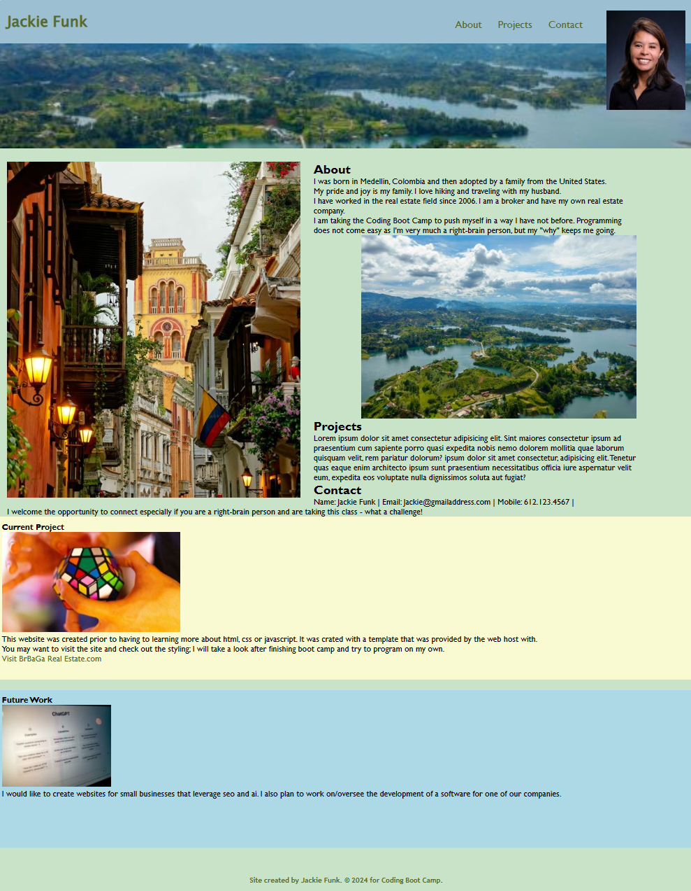

## Portfolio
Workign PORTFOLIO

## Description
This project lets people reference my work as a student (at the moment).  Later it will contain all my projects.In the future I will include a link as a reference.

## Code Sections
The navigation includes short-cuts to the About, Project descriptions and how to contact me.

The body of the document goes into detail about the three navigation headings.

I include a section about a Current Project and Future Work, which describes the type of work I plan to do after graduating from Boot Camp.

## Lessons Learned
I started with a lot of unnecessary html and css language.  I work diligently to figure out where I could streamline statements and make the project visually appealing.  A lot more work to do, but I like where I ended up for my first try.

I also learned to make a list of the people/sources you wish to acknowledge as you choose to use their work so you don't have to scroll through a bunch of images again to find the ones used.

## Screenshot

## Links

*  Deployed code in GitHub:
https://github.com/JKrech01/portfolio/blob/main/index.html

*  Working version of the code:

## Support
I google just about every issue I have or need to revisit or even learn about.  One of my favorite sources is W3Schools.  I like how they show the code and you can try it out.  Check it out:  (https://www.w3schools.com/)

## Acknowledgment
Thank you to Gary, our professor for giving us the resource to Unplash.com.  The site was easy to use and has images that you can download for free or pay for.

## License
Image of Guatape, Colombia - Jossie Diaz https://unsplash.com/@jossiegd
Image of Cartagena, Colombia - Ricardo Gomez Angel https://unsplash.com/@rgaleriacom
Image of a rubic's cube - Alan De La Cruz https://unsplash.com/@alandelacruz4
Image of ChatGPT - Emiliano Vittoriosi https://unsplash.com/@emilianovittoriosi

## Project Status
This is a work-in-progress which will be evolving over time.